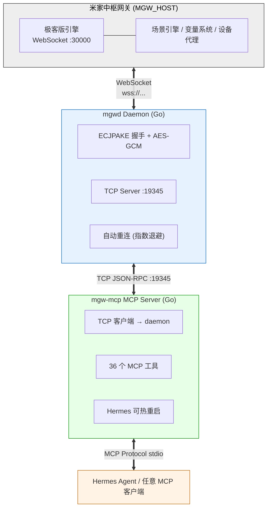

# Mi Home Gateway MCP

> ⚠️ **免责声明**: 本项目是独立的第三方开源项目，**与小米集团/Xiaomi Corp. 无关**。  
> 所有 API 接口均通过米家中枢网关极客版内置的本地 WebSocket 接口进行调用，使用官方提供的动态密码认证机制。  
> 本项目仅用于**个人学习研究目的**，不得用于商业用途。
> 
> **Please Note**: This is an independent project **not affiliated with Xiaomi Corp.**  
> All API calls are made through the official local WebSocket interface provided by the Mi Home Central Hub Gateway (Geek Edition), using the official dynamic passcode authentication mechanism.  
> This project is for **personal educational purposes only**, not for commercial use.

米家中枢网关（极客版）MCP 桥接服务。通过 WebSocket 连接网关，将场景管理、设备控制、变量操作等能力通过 MCP 协议暴露给 Hermes Agent。

## 架构



**一次密码 = 永久在线**: 密码仅在 ECJPAKE 握手时使用一次（~30秒有效期），握手成功后后续通信靠 AES-GCM 会话密钥加密，无需密码。

## ⚙️ 前置准备

### 提取 gateway.js

`mi_gateway_js/gateway.js` 是 WebSocket 协议的核心实现，需要从你的网关 Web UI 中提取。

> ⚠️ **法律说明**: gateway.js 来自米家极客版 Web UI 的 JavaScript 代码，**不包含在本仓库中**。  
> 你需要从自己的网关 Web UI 提取它，这属于个人设备上的观察学习行为。

**提取方法:**

1. 在浏览器打开 `http://YOUR_GATEWAY_IP/`
2. 打开 DevTools (F12) → Network 标签
3. 刷新页面, 找到 `ai-config-v5.xxx.js` 文件
4. 复制到 `mi_gateway_js/gateway.js`

或者在具备 node/npm 环境的机器上:

```bash
curl -o /tmp/bundle.js "http://YOUR_GATEWAY_IP/static/js/ai-config-v5.xxx.js"
# 从 bundle.js 中提取 GatewayDaemon 类并保存到 mi_gateway_js/gateway.js
```

### 安装 Node.js 依赖

```bash
cd mi_gateway_js
npm install
```

## 部署

### 前提

| 需要 | 来源 | 说明 |
|:----|:-----|:------|
| `mi_gateway_js/gateway.js` | 从网关 Web UI 提取 | WebSocket 协议实现，见前置准备 |
| `mi_gateway_js/node_modules` | `cd mi_gateway_js && npm install` | Node.js 依赖 |
| Go 1.25+ | https://go.dev/dl/ | 构建工具 |
| 网关 IP 地址 | 路由器/米家 App | 如 `192.168.31.253` |
| 6 位动态密码 | 网关屏幕按按钮 | 有效期 ~2 分钟，仅握手用一次 |

### 1. 构建

```bash
make build
# 或手动
go build -o bin/mgwd ./cmd/mgwd/
go build -o bin/mgw-mcp ./cmd/mgw-mcp/
```

### 2. 配置网关地址

**方式 A：环境变量（推荐 systemd 用户）**
```bash
export MGW_HOST=192.168.31.253
```

**方式 B：MCP 工具（首次部署）**
```
→ set_host("192.168.31.253")
```

持久化到 `~/.hermes/mihome/host`，重启后自动读取。

### 3. 启动 daemon

```bash
# 方式 A：手动启动
./bin/mgwd --host 192.168.31.253 --jsdir ./mi_gateway_js

# 方式 B：使用 systemd（推荐）
make install
systemctl --user enable --now mgwd
```

> `--host` / `--passcode` 优先级：CLI args > 环境变量 > 本地文件

### 4. 启动 MCP Server

**方式 A：Hermes 自动管理（推荐）**
```yaml
# ~/.hermes/config.yaml
mcp_servers:
  mihome:
    command: /path/to/bin/mgw-mcp
    args: ["--daemon-addr", "127.0.0.1:19345"]
    timeout: 30
    connect_timeout: 30
```

**方式 B：手动**
```bash
./bin/mgw-mcp --daemon-addr 127.0.0.1:19345
```

### 5. 首次连接

```
→ set_host("192.168.31.253")    # 仅首次
→ set_passcode("123456")        # 每次密码变更
→ gateway_status()              # 验证连接
```

配置持久化后，后续只需 `set_passcode` 即可重连。

## 运维须知

### 🛑 绝对不要重启 mgwd daemon

```bash
# ❌ 禁止
systemctl --user restart mgwd
systemctl --user stop mgwd
```

重启 daemon = WebSocket 断连 = 密码过期 = **需要人工按网关生成新密码**才能恢复。

### ✅ 正确的运维操作

| 需求 | 正确做法 | 原因 |
|:-----|:---------|:------|
| 换密码 | 写 `~/.hermes/mihome/passcode` 文件 | daemon 每 2 秒轮询，自动重连 |
| 重启 MCP server | `pkill -f mgw-mcp` | Hermes 自动 respawn，daemon 不受影响 |
| 更新 Go 代码 | kill MCP server 进程 | daemon TCP 模式，MCP 重启不影响连接 |

### 密码过期恢复流程

```
1. 按网关按钮 → 获得 6 位动态码
2. echo -n "新密码" > ~/.hermes/mihome/passcode
3. daemon 2 秒内自动连接（无需其他操作）
```

## MCP 工具

36 个 MCP 工具，分为以下类别：

### 🔌 连接管理 (3)
| 工具 | 说明 |
|------|------|
| `set_passcode` | 设置 6 位动态密码，建立网关连接 |
| `set_host` | 配置网关 IP 地址（持久化） |
| `gateway_status` | 检查网关连接状态 |

### 📱 设备查询 (5)
| 工具 | 说明 |
|------|------|
| `list_devices` | 查看所有设备 |
| `get_device_state` | 获取设备当前状态 |
| `device_specs` | 查看设备 MiOT 规格 |
| `list_device_controls` | 设备的可写属性列表 |
| `list_device_events` | 设备的可触发事件列表 |

### 🎬 场景管理 (8)
| 工具 | 说明 |
|------|------|
| `list_scenes` | 查看所有自动化场景 |
| `get_scene_graph` | 查看单个场景的节点图 |
| `create_scene` | 创建自动化场景 |
| `delete_scene` | 删除场景 |
| `toggle_scene` | 启用/禁用场景 |
| `execute_scene` | 手动触发场景 |
| `rename_scene` | 重命名场景 |
| `analyze_scenes` | 分析场景节点结构 |

### 🔢 变量管理 (8)
| 工具 | 说明 |
|------|------|
| `get_variables` | 列出自动化变量 |
| `get_variable_scopes` | 查看变量作用域 |
| `get_variable_details` | 查看变量详细配置 |
| `get_variable_value` | 获取变量当前值 |
| `set_variable` | 设置变量值 |
| `create_variable` | 创建变量 |
| `delete_variable` | 删除变量 |
| `set_variable_config` | 修改变量配置 |

### 💾 备份管理 (6)
| 工具 | 说明 |
|------|------|
| `list_backups` | 查看备份列表 |
| `create_backup` | 创建配置备份 |
| `restore_backup` | 从备份恢复 |
| `get_backup_config` | 获取备份配置 |
| `set_backup_config` | 设置备份配置 |
| `get_backup_progress` | 查看备份进度 |

### 🔧 系统管理 (5)
| 工具 | 说明 |
|------|------|
| `daemon_status` | 检查 daemon 运行状态 |
| `get_gateway_config` | 获取网关配置 |
| `clear_passcode` | 清除保存的密码 |
| `reconnect_daemon` | 强制重连 daemon |
| `get_gateway_logs` | 获取网关日志 |

### 🔗 高级操作 (1)
| 工具 | 说明 |
|------|------|
| `call_api` | 直接调用网关 API（高级） |

## 可用自动化模块 (setGraph)

| 分类 | 模块 | 中文名 |
|------|------|--------|
| 设备 | `deviceInput` | 事件发生或状态更新 |
| 设备 | `deviceGet` | 查询当前状态 |
| 设备 | `deviceOutput` | 执行操作 |
| 设备 | `deviceInputSetVar` | 设备触发赋值 |
| 设备 | `deviceGetSetVar` | 查询设备并赋值 |
| 条件 | `condition` | 当-如果-就 |
| 条件 | `statusLast` | 状态维持了一段时间 |
| 条件 | `timeRange` | 时间段 |
| 逻辑 | `logicAnd` / `logicOr` / `logicNot` | 与/或/非 |
| 时间 | `alarmClock` / `delay` | 定时 / 延时 |
| 变量 | `varGet` / `varChange` | 变量读写 |
| 变量 | `varSetNumber` / `varSetString` | 数值运算 / 文本拼接 |
| 流程 | `loop` / `onLoad` / `register` | 循环 / 启动 / 状态 |
| 流程 | `counter` / `onlyNTimes` | 计数 / 限次 |
| 流程 | `modeSwitch` / `eventSequence` / `signalOr` | 切换 / 顺序 / 事件或 |

## 许可证

MIT License — 仅限个人学习研究使用。
